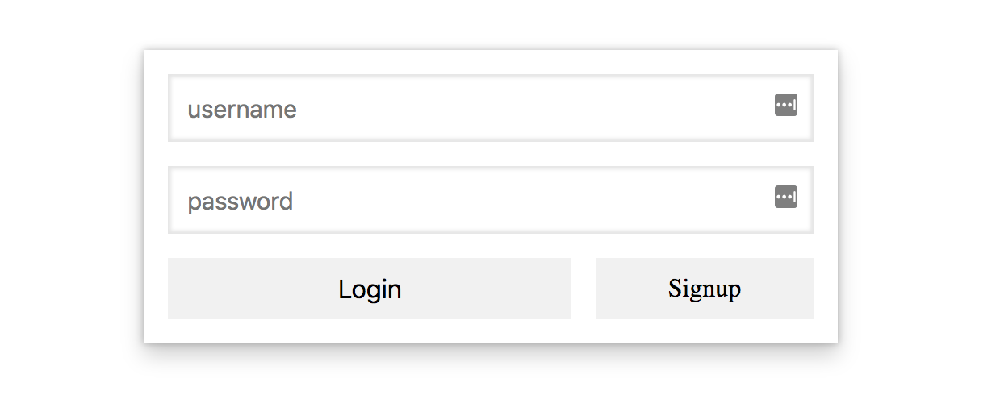
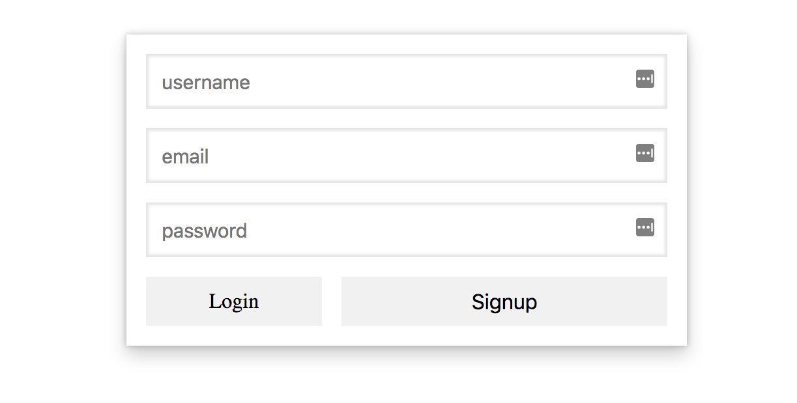
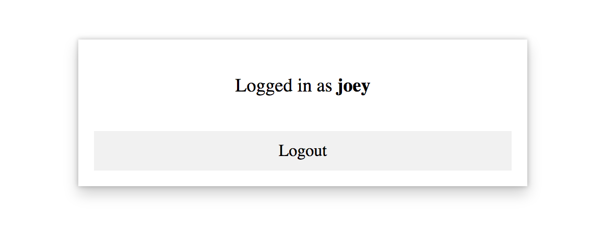

<<<<<<< HEAD
# Accept a Card Payment

Build a simple checkout form to collect card details. Included are some basic build and run scripts you can use to start up the application.

## Running the sample

1. Build the server

```
npm install
```

2. Run the server

```
npm start
```

3. Go to [http://localhost:4242/checkout.html](http://localhost:4242/checkout.html)
=======
# Express Sequelize Authentication Boilerplate

To get started

- you must have yarn, mysql, and node installed
- create local db named custom_auth_tutorial
- yarn install
- yarn start

Recommended Installations

 - nodemon
 - mySQL Workbench
 - postman


Inspired by my medium post here:
https://medium.com/@jgrisafe/custom-user-authentication-with-express-sequelize-and-bcrypt-667c4c0edef5

# Screen Shots

## login page


## register page


## logged-in view

>>>>>>> 054d613a44791e5f88f43e8697f6e4c91b8dbaf6
